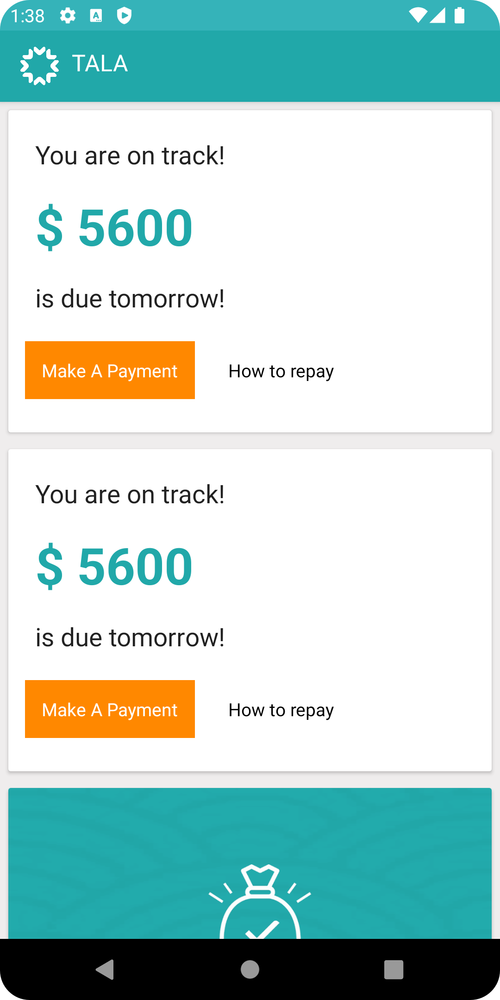
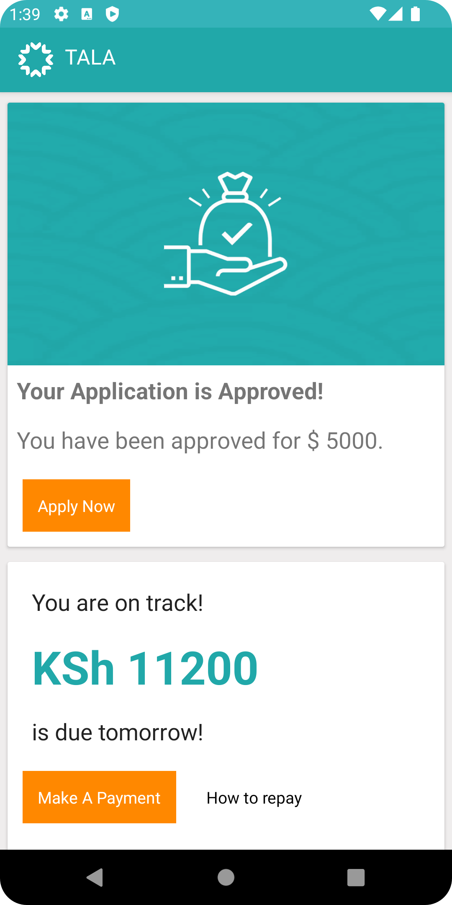
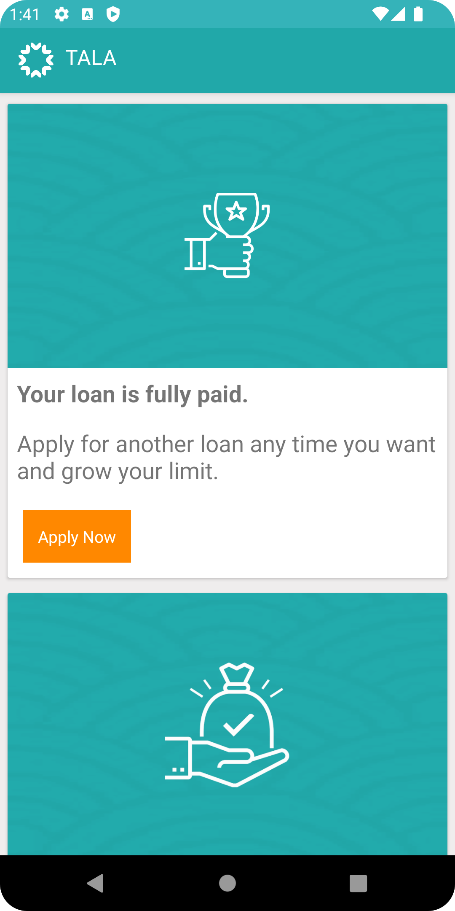
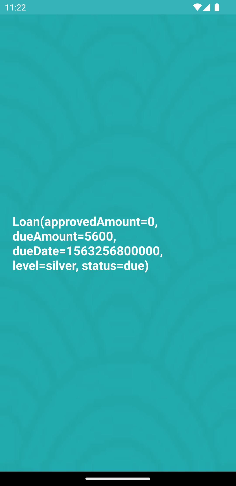

# TALA Finanace App -

### Output Screenshots and Videos
---
| Due loan item | Approved loan item | Paid loan item | Detail Page |
|:-:|:-:|:-:|:-:|
|  |  |  |  |

## 📃 TechStack used
- [Kotlin](https://kotlinlang.org/) - First class and official programming language for Android development.
- [Paging 3.0 with multiple viewType](https://developer.android.com/topic/libraries/architecture/paging/v3-overview) - The Paging library helps you load and display pages of data from a larger dataset from local storage or over network.
- [Coroutines](https://kotlinlang.org/docs/reference/coroutines-overview.html) - For asynchronous and more..
- [Hilt](https://developer.android.com/training/dependency-injection/hilt-android) - Jetpack Dependency Injection Framework
- [Android Architecture Components](https://developer.android.com/topic/libraries/architecture) - Collection of libraries that help you design robust, testable, and maintainable apps.
  - [LiveData](https://developer.android.com/topic/libraries/architecture/livedata) - Data objects that notify views when the underlying database changes.
  - [ViewModel](https://developer.android.com/topic/libraries/architecture/viewmodel) - Stores UI-related data that isn't destroyed on UI changes. 
  - [DataBinding](https://developer.android.com/topic/libraries/view-binding) - Generates a binding class for each XML layout file present in that module and allows you to more easily write code that interacts with views.
- [Retrofit](https://square.github.io/retrofit/) - A type-safe HTTP client for Android and Java.
- [ktlint](https://github.com/JLLeitschuh/ktlint-gradle) - This plugin creates convenient tasks in your Gradle project that run ktlint checks or do code auto format.

#### Lazy Loading


#### Assumption Added
1- Have added unique Id on testData.json for each loan records.
2- Added Locals.json in local assests folder and parsed the data and shown currency. [Local handling]
3- testData.json published on free server provided by Railway.app, It is live for limited hours [Network handling](https://tala-mock-server-production.up.railway.app/records?pagesize=3&pageno=3)
4- "Paging 3.0 with Loading state" added so that all done could not be load once.

## 🚀 Getting Started
These instructions will get you a copy of the project up and running on your local machine for development and testing purposes.

### Prerequisites
*   Android Studio 3.2+
*   Java JDK

### Installing
Follow these steps if you want to get a local copy of the project on your machine.

#### 1. Clone or fork the repository by running the command below	
```
git https://github.com/Ekta-jain/TALA
